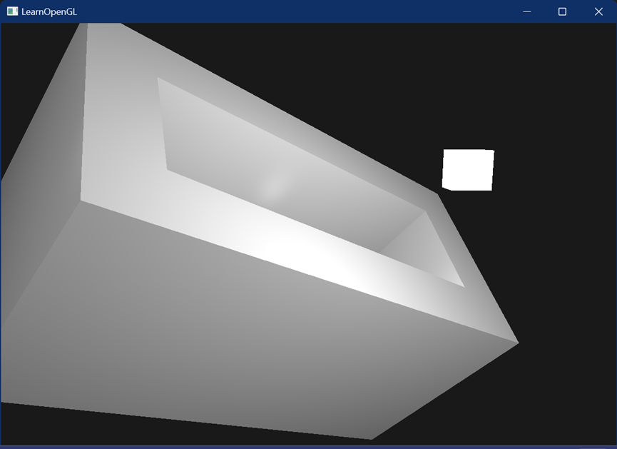

# MyCAD：三维CAD建模课程大作业
本项目为一个基于欧拉操作的三维建模项目，能基于 mvfs, mev, mef, kemr 和 kfmrh 5个基本欧拉操作和 sweep 扫掠操作生成对应的立方体，用OpenGL实现可视化。

### 项目说明

- 结构说明
  - 源文件：在 ./MyCAD 目录下
    - Camera.cpp / Camera.h：三维空间中的摄像机文件
    - Element.cpp / Element.h：欧拉操作的对象，包括Solid, Face, Loop, Coedge, Edge, Vertex和Point
    - EulerOperation.cpp / EulerOperation.h：欧拉操作，共定义了mvfs, mev, mef, kemr 和 kfmrh 5个基本操作和 sweep 扫掠操作
    - Generator.cpp / Generator.h：顶点数据生成文件
    - Shader.cpp / Shader.h：着色器文件
    - Test.cpp / Test.h：测试用例文件
  - 其他文件：在 ./CAD 目录下
    - 顶点着色器文件：Vertex.vert, LightVertex.vert
    - 片段着色器文件：Fragment.frag, LightFragment.frag
- 编译说明
  - 项目依赖
    - GLM：C++数学库，提供了在计算机图形编程中常用的各种数学操作和函数
    - GLAD：提供跨平台的解决方案，用于加载不同版本的OpenGL和OpenGL扩展所提供的功能
    - GLFW：用于创建和管理窗口、处理输入和事件，并与OpenGL等图形库进行交互
  - 项目配置
    - 本项目使用VS2022编译和运行
    - 打开MyCAD.sln工程文件后，将活动解决方案配置平台设置为“x86”后，点击“生成解决方案”即可生成可执行文件
- 操作说明
  - 键盘操作
    - $WASD$：控制摄像机前后左右的移动
    - $\uparrow\downarrow$：控制摄像机上下移动
  - 鼠标操作
    - 移动：控制视角的转动
    - 滚轮：控制视角的大小

### 接口说明

- 本项目所有的接口都在Test.cpp中，mian.cpp对Test类中不同静态方法的调用实现不同的效果
- 具体接口
  - 测试接口
    - Test::createBody()：构造一个带有内环的立方体
    - Test::testSweep()：扫掠操作测试函数，通过sweep操作构造无环的简单立方体，打印相关信息
  - 主函数对接接口
    - Test::testRingGenerator(vector<glm::vec3>& vertices)：构造器测试函数，通过基础欧拉操作构造带环立方体，将离散化信息存入 vertices
    - Test::testSweepGenerator(vector<glm::vec3>& vertices)：构造器测试函数，通过sweep操作构造无环立方体，将离散化信息存入 vertices
    - Test::testSweepRingGenerator(vector<glm::vec3>& vertices)：构造器测试函数，通过sweep操作构造带环立方体，将离散化信息存入 vertices
- 主函数对接接口使用
  - 通过对main.cpp第138行代码中不同主函数对接接口的调用实现不同立方体的可视化
  - 可以利用欧拉操作自行添加更多立方体

### 其他说明

- 调试信息
  - 我通过重载输出运算符的方式，提供了 Loop, Coedge, Edge, Vertex 和 Point 对象信息的打印方法， 通过标准输出流cout可以方便地查看对象内容
  - 我提供了 Solid 对象的查看接口 printSolid()，可以打印出 Solid 对象中所有的下层信息
- 可视化
  - 我在OpenGL中考虑了3种光照：环境光照（ambient），漫反射光照（diffuse）和镜面光照（specular），可以通过 main.cpp 中的对应代码修改光照参数
  - 由于光照的需要，我基于 Loop 的方向计算面的法向量信息，并且将其用于渲染。testRingGenerator接口构造的带环立方体基于基础欧拉操作，含有正确的法向量信息；testSweepRingGenerator接口构造的带环立方体由于通过扫掠操作生成，部分法向量可能相反，不能模拟出真实的光照结果。手动构造立方体时需要注意面的法向量信息

